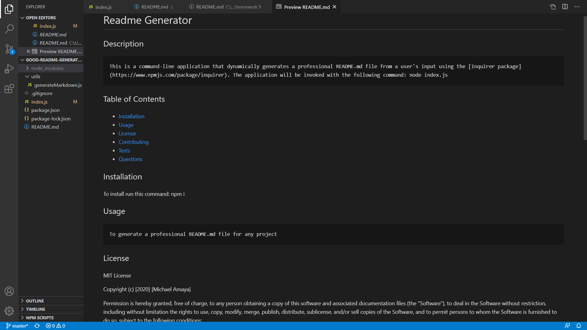

  # Readme Generator
  ## Description
    This is a command-line application that dynamically generates a professional README.md file from a user's input using the [Inquirer package](https://www.npmjs.com/package/inquirer). The application will be invoked with the following command: node index.js
  ## Screenshot
  

  ## Table of Contents
  * [Installation](#installation)
  * [Usage](#usage)
  * [License](#license)
  * [Contributing](#contributing)
  * [Tests](#tests)
  * [Questions](#questions)
  ## Installation
  To install run this command:  npm i
  ## Usage
    To generate a professional README.md file for any project
  ## Badge
  https://img.shields.io/badge/eradicador-100%25-brightgreen
    
  ## License
  MIT License

 Copyright (c) [2020] [Michael Amaya]

 Permission is hereby granted, free of charge, to any person obtaining a copy
 of this software and associated documentation files (the "Software"), to deal
 in the Software without restriction, including without limitation the rights
 to use, copy, modify, merge, publish, distribute, sublicense, and/or sell
 copies of the Software, and to permit persons to whom the Software is
 furnished to do so, subject to the following conditions:

 The above copyright notice and this permission notice shall be included in all
 copies or substantial portions of the Software.

 THE SOFTWARE IS PROVIDED "AS IS", WITHOUT WARRANTY OF ANY KIND, EXPRESS OR
 IMPLIED, INCLUDING BUT NOT LIMITED TO THE WARRANTIES OF MERCHANTABILITY,
 FITNESS FOR A PARTICULAR PURPOSE AND NONINFRINGEMENT. IN NO EVENT SHALL THE
 AUTHORS OR COPYRIGHT HOLDERS BE LIABLE FOR ANY CLAIM, DAMAGES OR OTHER
 LIABILITY, WHETHER IN AN ACTION OF CONTRACT, TORT OR OTHERWISE, ARISING FROM,
 OUT OF OR IN CONNECTION WITH THE SOFTWARE OR THE USE OR OTHER DEALINGS IN THE
 SOFTWARE.

  ## Contributing
  
  ## Tests
  To run test run this command: run test
  * Test video of the application: https://drive.google.com/file/d/162Gk8Lhyq8KR7B00d69eKAOh-DT4BYGh/view
  ## Questions
  if you have any question contact me at janisepinto@yahoo.com and here my github link: 
  [mygithub](https://github.com/eradicador)

